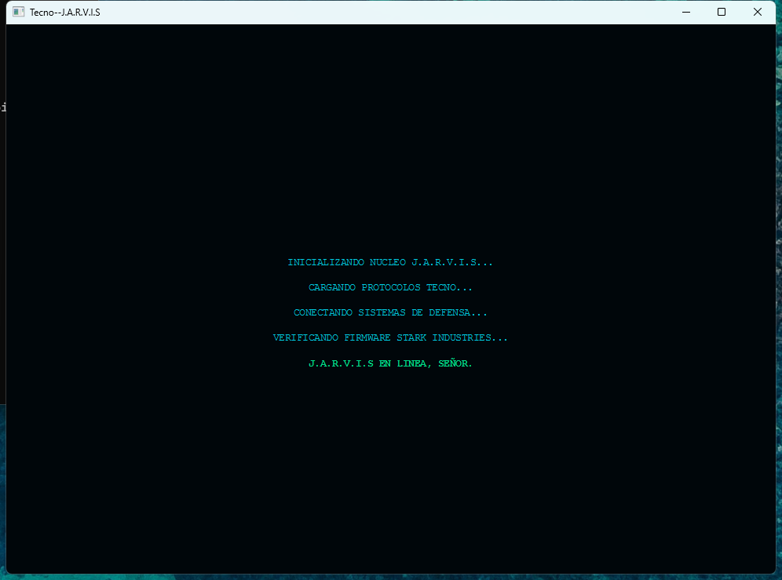
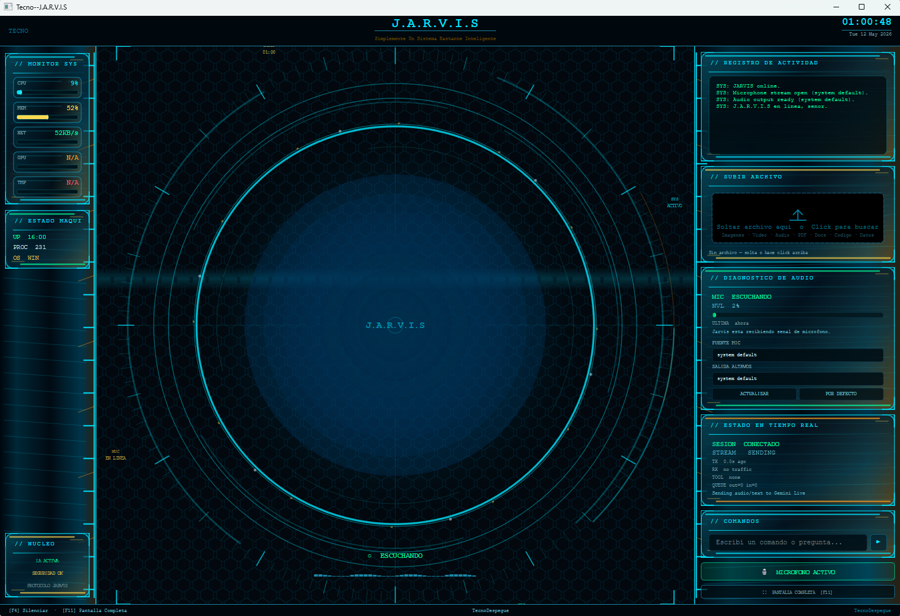

# Tecno--J.A.R.V.I.S

Tecno--J.A.R.V.I.S es un asistente de escritorio con interfaz HUD futurista, voz en tiempo real, control del sistema, vision de pantalla/camara, carga de archivos y ejecucion de tareas multi-paso. El proyecto esta impulsado por TecnoDespegue, agencia de automatizacion e inteligencia artificial: https://www.tecnodespegue.com





## Que puede hacer

| Area | Capacidades |
|------|-------------|
| Voz en tiempo real | Escucha por microfono, responde con Gemini Live y muestra estado de sesion/audio. |
| Control del escritorio | Puede abrir aplicaciones, controlar ventanas, interactuar con el sistema y ejecutar acciones locales. |
| Vision | Puede analizar pantalla, camara e imagenes para ayudar con tareas visuales. |
| Archivos | Permite soltar archivos en la interfaz y pedir analisis, resumen o acciones sobre ellos. |
| Web y busqueda | Puede buscar informacion, analizar paginas y asistir con navegacion automatizada. |
| Productividad | Puede ayudar con recordatorios, clima, vuelos, mensajes, archivos, codigo y presentaciones. |
| Memoria de sesion | Mantiene contexto de tareas y progreso durante la sesion. |
| UI futurista | Interfaz PyQt6 estilo J.A.R.V.I.S con paneles HUD, diagnostico de audio y estado en vivo. |

## Instalacion rapida

Requisitos base:

- Python 3.10 o superior.
- Conexion a internet durante la instalacion.
- Una API key de Gemini.
- Windows recomendado. Linux/macOS tienen instalador, pero algunas funciones de control del sistema son especificas de Windows.

Windows:

```bat
install.bat
```

Linux/macOS:

```sh
sh install.sh
```

El instalador automatico:

- Detecta el sistema operativo.
- Crea `.venv` si falta.
- Instala dependencias Python.
- Instala navegadores de Playwright.
- Crea `config/api_keys.json` si falta.
- Genera o actualiza `run.bat` y `run.sh`.
- En Linux/macOS intenta instalar dependencias del sistema conocidas cuando hay gestor compatible.

## Configuracion

Despues de instalar, edita `config/api_keys.json` y pega tu clave de Gemini:

```json
{
    "gemini_api_key": "TU_API_KEY",
    "os_system": "windows"
}
```

No subas `config/api_keys.json` a GitHub. Ya esta ignorado por `.gitignore`.

## Ejecutar

Windows:

```bat
run.bat
```

Linux/macOS:

```sh
sh run.sh
```

Tambien se puede ejecutar manualmente:

```sh
.venv/Scripts/python.exe main.py
```

En Linux/macOS usa:

```sh
.venv/bin/python main.py
```

## Verificar instalacion

Para probar sin instalar nada nuevo:

```sh
python install.py --check
```

Para validar dependencias criticas despues de instalar:

```sh
.venv/Scripts/python.exe -c "import PyQt6, sounddevice, cv2, numpy, psutil, playwright, pyautogui; print('imports-ok')"
```

## Archivos importantes

| Archivo | Proposito |
|---------|-----------|
| `install.py` | Instalador principal cross-platform. |
| `install.bat` | Instalador facil para Windows. |
| `install.sh` | Instalador para Linux/macOS. |
| `run.bat` | Lanza la app en Windows usando `.venv`. |
| `run.sh` | Lanza la app en Linux/macOS usando `.venv`. |
| `main.py` | Loop principal de voz, audio y herramientas. |
| `ui.py` | Interfaz PyQt6 HUD futurista. |
| `requirements.txt` | Dependencias Python. |

## Contribuir

Antes de enviar cambios, lee `CONTRIBUTING.md`. Las contribuciones deben preservar instalacion, arranque, UI, branding y seguridad del proyecto.

## Seguridad y permisos

Tecno--J.A.R.V.I.S esta pensado como asistente local de alto permiso. Puede interactuar con archivos, ventanas, navegador, audio, pantalla y acciones del sistema. Usalo solamente en equipos propios o entornos donde tengas autorizacion.

## Agencia

Proyecto desarrollado y personalizado para TecnoDespegue.

Sitio web: https://www.tecnodespegue.com
